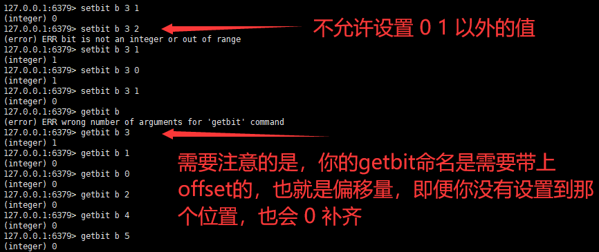
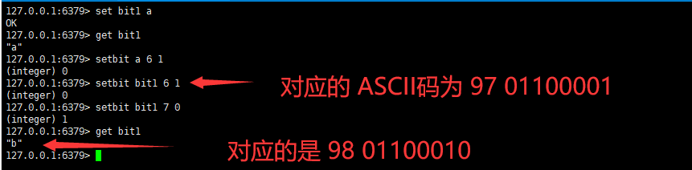
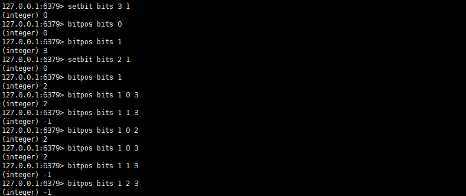

### BitMap

http://redisdoc.com/bitmap/setbit.html

从这里可以看到详细的解释。

当然，你也可以这样设置，例如，你可以将一个key设置成一个字母，我们知道一个字母是占有一个字节的，也就是八位，我们同样可以使用setbit命令去修改他。

a 对应的 ASCII 码是 97，转换为二进制数据是 01100001
b 对应的 ASCII 码是 98，转换为二进制数据是 01100010

**注意**

位图在redis中值`offset` 参数必须大于或等于 `0` ，小于 2^32 (bit 映射被限制在 512 MB 之内)。

你可以设置一个随意的offset，但是不能超过上面的范围。

同时，当你`setbit`成功的时候，返回的是原来那个位的数，也就是修改之前的位的值。

`getbit`同样也必须带上`offset`才可以获得对应`offset`的值。

如果你操作一个不存在的位图的话，会返回0，例如你想对他计数，又或者希望查看他是否存在。

http://redisdoc.com/bitmap/bitcount.html

总之，`bitcount`返回的是计算给定字符串中，被设置为 `1` 的比特位的数量，可以使用负值

> 使用 bitmap实现用户上线次数统计

Bitmap 对于一些特定类型的计算非常有效。

假设现在我们希望记录自己网站上的用户的上线频率，比如说，计算用户 A 上线了多少天，用户 B 上线了多少天，诸如此类，以此作为数据，从而决定让哪些用户参加 beta 测试等活动 —— 这个模式可以使用 [SETBIT key offset value](http://redisdoc.com/bitmap/setbit.html#setbit) 和 [BITCOUNT key [start\] [end]](http://redisdoc.com/bitmap/bitcount.html#bitcount) 来实现。

比如说，每当用户在某一天上线的时候，我们就使用 [SETBIT key offset value](http://redisdoc.com/bitmap/setbit.html#setbit) ，以用户名作为 `key`，将那天所代表的网站的上线日作为 `offset` 参数，并将这个 `offset` 上的为设置为 `1` 。

举个例子，如果今天是网站上线的第 100 天，而用户 peter 在今天阅览过网站，那么执行命令 `SETBIT peter 100 1` ；如果明天 peter 也继续阅览网站，那么执行命令 `SETBIT peter 101 1` ，以此类推。

当要计算 peter 总共以来的上线次数时，就使用 [BITCOUNT key [start\] [end]](http://redisdoc.com/bitmap/bitcount.html#bitcount) 命令：执行 `BITCOUNT peter` ，得出的结果就是 peter 上线的总天数。

前面的上线次数统计例子，即使运行 10 年，占用的空间也只是每个用户 10*365 比特位(bit)，也即是每个用户 456 字节。对于这种大小的数据来说， [BITCOUNT key [start\] [end]](http://redisdoc.com/bitmap/bitcount.html#bitcount) 的处理速度就像 [GET key](http://redisdoc.com/string/get.html#get) 和 [INCR key](http://redisdoc.com/string/incr.html#incr) 这种 O(1) 复杂度的操作一样快。

如果你的 bitmap 数据非常大，那么可以考虑使用以下两种方法：

1. 将一个大的 bitmap 分散到不同的 key 中，作为小的 bitmap 来处理。使用 Lua 脚本可以很方便地完成这一工作。
2. 使用 [BITCOUNT key [start\] [end]](http://redisdoc.com/bitmap/bitcount.html#bitcount) 的 `start` 和 `end` 参数，每次只对所需的部分位进行计算，将位的累积工作(accumulating)放到客户端进行，并且对结果进行缓存 (caching)。

> bitpos

这个参数，将会返回第一个遇到位数值是1的索引号

找不到会返回 `-1`

> bittop

更加丰富的操作符

http://redisdoc.com/bitmap/bitop.html

