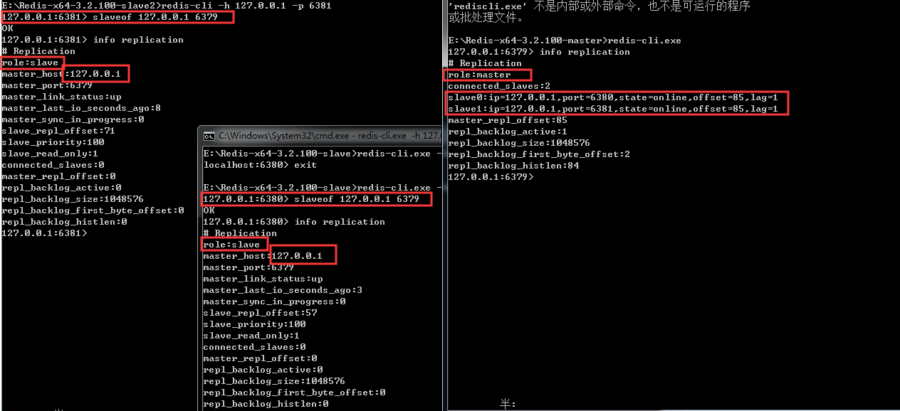
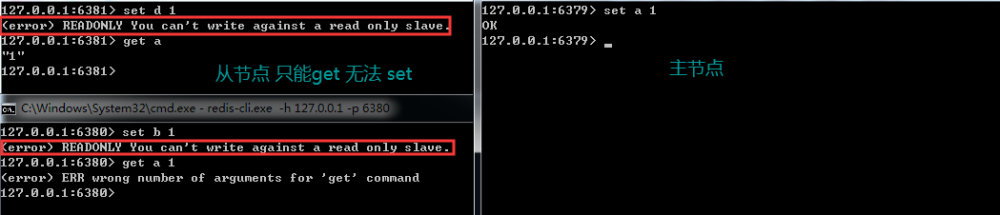
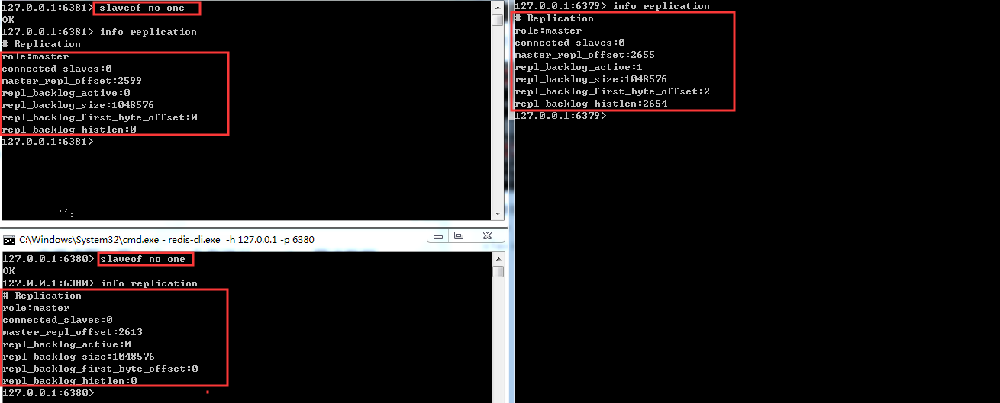
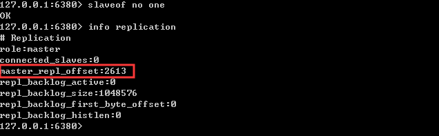
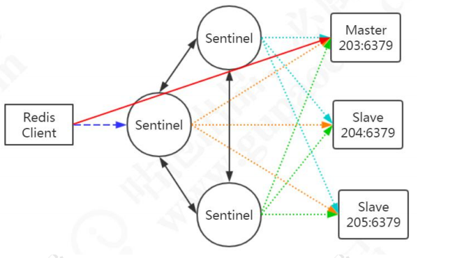

#### Redis 的分布式


##### 为什么需要Redis集群

Redis 本身的 QPS 已经很高了，但是如果在一些并发量非常高的情况下，性能还是 会受到影响。这个时候我们希望有更多的 Redis 服务来完成工作。

##### 扩展

第二个是出于存储的考虑。因为 Redis 所有的数据都放在内存中，如果数据量大， 很容易受到硬件的限制。升级硬件收效和成本比太低，所以我们需要有一种横向扩展的 

方法。

##### 可用性

第三个是可用性和安全的问题。如果只有一个 Redis 服务，一旦服务宕机，那么所有的客户端都无法访问，会对业务造成很大的影响。另一个，如果硬件发生故障，而单 机的数据无法恢复的话，带来的影响也是灾难性的。 可用性、数据安全、性能都可以通过搭建多个 Reids 服务实现。其中有一个是主节 点（master），可以有多个从节点(slave)。主从之间通过数据同步，存储完全相同的数 据。如果主节点发生故障，则把某个从节点改成主节点，访问新的主节点。


#### Redis 主从复制（repllcation）

如果你是伪集群，例如在本地起了三个redis服务，你启动`redis-cli`去连接的时候会默认连接6379的端口

你希望连接到指定的host的话可以这样写

```
redis-cli -h 127.0.0.1 -p 63xx
```

关于加入集群的几种方法。

* 你可以将slave节点的reids.conf文件中添加这样的配置

  ```properties
  slaveof 127.0.0.1 6379
  ```

  在主从切换的时候，这个配置会被重写成：

  ```properties
  # Generated by CONFIG REWRITE 
  replicaof 192.168.8.203 6379
  ```

* 你也可以在启动服务的时候添加参数指定master节点。

  ```
  ./redis-server --slaveof 127.0.0.1 6379
  ```

* 当然还一种就是你的客户端连接成功后，直接在命名行输出 `slaveof 127.0.0.1 6397`



从节点不能写入数据（只读），只能从master节点同步数据。即 get 成功，set 失败



断开复制

```
slaveof no none
```



当你断开了后，每个节点都会变成自己的主节点，不再复制数据。


#### 主从复制原理

##### 连接阶段

* slave node 启动时（执行 slaveof 命令），会在自己本地保存 master node 的 信息，包括 master node 的 host 和 ip。 

* slave node 内部有个定时任务 replicationCron（源码 replication.c），每隔 1 秒钟检查是否有新的 master node 要连接和复制，如果发现，就跟 master node 建立 socket 网络连接，如果连接成功，从节点为该 socket 建立一个专门处理复制工作的文件 事件处理器，负责后续的复制工作，如接收 RDB 文件、接收命令传播等。 当从节点变成了主节点的一个客户端之后，会给主节点发送 ping 请求。

##### 数据同步阶段

master node 第一次执行全量复制，通过 bgsave 命令在本地生成一份 RDB 快 照，将 RDB 快照文件发给 slave node（如果超时会重连，可以调大 repl-timeout 的值）。 slave node 首先清除自己的旧数据，然后用 RDB 文件加载数据。


> 生成 RDB 期间，master 接受到的命名怎么处理

开始生成RDB文件时，master会把所有新的**写命令**缓存到内存中，在salve node 保存了RDB之后，再将新的写命令复制给 slave node


##### 命令传播阶段

master node 持续将**写命令**，异步复制给 slave node延迟是不可避免的，只能通过优化网络。

```properties
repl-disable-tcp-nodelay no
```

当设置成 yes 时，TCP会对包进行合并，所以会减少带宽。不够由于发送频率次数减少，将会导致节点数据延迟增加，一致性变差；具体发送频率与 Linux 内核的配置有关，默认配置为 40ms。当设置为 no 时，TCP 会立马将主节点的数据发送给从节点，带宽增加但延迟变小。

一般来说，只有当应用对 Redis 数据不一致的容忍度较高，且主从节点之间网络状 况不好时，才会设置为 yes；多数情况使用默认值 no。

> 如果从节点有一段时间断开了与主节点的连接，是不是要重新全量复制一遍，如果可以增加复制，怎么知道上次复制到了哪里。

通过 `master_repl_offset`来记录的偏移量。




##### 主从复制的不足

主从模式解决了数据备份和性能（通过读写分离）的问题，但是还是存在一些不足：

* RDB文件过大的情况下，同步非常耗时
* 在一主一从或者一主多从的情况下，如果主服务器挂了，对外提供了服务就不能用了，单点我呢提没有得到解决。如果每次都是手动把之前的从服务器切换成主服务器，比较费时费力，还会造成一定时间的服务不可用的情况。


#### 可用性保证之 Sentinel

##### Sentinel 原理

如果实现主从的自动切换？

**大概的思路就是有个程序会监视redis服务，如果master挂掉了，可以自动发送命令切换。**

创建一台监控服务器来监控所有Redis服务节点的状态，比如master 节超过一定时间没有给监控服务器发送心跳报文，就把 master 标记为下线，然后把某一个slave 变成master，应用每一次都是从这个监控服务器拿到master的地址。

> 如果监控服务本身出问题了怎么办？

显然，我这样就拿不到master的地址了，应用也没有办法访问。要是再启一个监控去监控的话，也会面临相同的问题，也就陷入了一个死循环。

这个时候Redis 的 Sentinel 就是这种思路：通过运行监控服务器来保证服务可靠性。

从Redis2.8版本起，提供了一个稳定版本的Sentinel（哨兵），用来解决高可用的问题。他是一个特殊状态的redis实例。

我们会启动一个或者多个Sentinel的服务，通过(src/redis-sentinel,linux)，他本质上只是一个运行在特殊模式下的Redis，Sentinel 通过 info 命令得到被监听的 Redis 机器的 master，slave 等信息。



为了保证监控服务器的可用性，我们会对Sentinel做集群的部署。Sentinel 既监控了所有的Redis服务，**Sentinel 之间互相监控。**

**注意**：Sentinel 本身没有主从之分，只有 Redis 服务节点有主从之分。

**概念梳理**：master，slave（redis group），sentinel，sentinel 集合


##### Sentinel 中的服务下线

Sentinel 默认每秒钟1次的频率想Redis 服务器节点发送PING命令。如果在down-after-milliseconds内都没有收到有效回复，Sentinel 会将该服务标记为下线，**主观下线**

```properties
# sentinel.conf sentinel 主机名字 和具体超时时间
down-after-milliseconds <master-name> <milliseconds>
```

这个时候Sentinel 节点会继续询问其他的Sentinel节点，确定这个节点是否下线，如果多数Sentinel节点都认为master下线，master才真正确定被下线（**客官下线**），这个时候就需要重新选举master


##### Sentinel 中的故障转移

如果master被标记成下线，就会开始故障转移流程。

既然有这么多的Sentinel节点，由谁来做故障转移的事情呢？

故障转移流程的第一部就是在Sentinel集群中选择一个Leader，由Leader完成故障转移流程。Sentinel通过Raft算法，实现Sentinel选举。


##### Ratf 算法

在分布式存储系统中，通常通过所维护多个副本来提高系统的可用性，那么多个节点之间必须要面对数据一致性问题，Raft的目的就是通过赋值的方式，使所有节点达成一致，但是这么多节点，以哪个节点的数据为准，这就需要选出一个leader。

大体上有两个步骤： 领导选举，数据复制。

Raft 是一个共识算法（consensus algorithm）。比如比特币之类的加密货币，就需要共识算法。Spring Cloud 的注册中心解决方案Consul也用到了Raft协议。

Raft 的核心思想：先到先得，少数服从多数。

Raft 算法演示：http://thesecretlivesofdata.com/raft/

**总结**：

Sentinel 的 Raft 算法和 Raft 论文略有不同。

* master 客观下线触发选举，而不是过了 election timeout 时间开始选举。也就意味着应该是**客观下线**才会触发向选举，而不是**主动下线**
* Leader 并不会把自己成为Leader 的消息发给其它Sentinel。其它的Sentinel等待Leader 从 slave 选出master 后，检测到新的master正常工作后，就会去掉客观的下线的标识，从而不需要进入故障转移流程。


> 怎么让一个原来的slave 节点成为主节点

* 选出Sentinel Leader 之后，由Sentinel Leader 向某个节点发送 slaveof no none命名，让他成为独立的节点。
* 然后想其他节点发送 slaveof x.x.x.x xxxx (本机服务)，让他成为这个节点的子节点，故障转移完成。


> 这么多从节点，选谁成为主节点

关于从节点选举，一共有四个因素影响选举的结果，分别是**断开连接时长**，**优先级排序**，**复制数量**，**进程id**。

* 如果与哨兵连接断开的比较久，超过了某个阈值，就会直接失去选举权。如果拥有选举权，那就看谁的优先级高，这个在配置文件里可以设置（replica-priority 100）,数值越小，优先级越高。
* 如果优先级相同，就看谁从master中赋值的数据最多（赋值偏移量最大），选最多的那个，如果复制数目也相同，就选择进程id最小的那个。


#### Sentinel 实战

