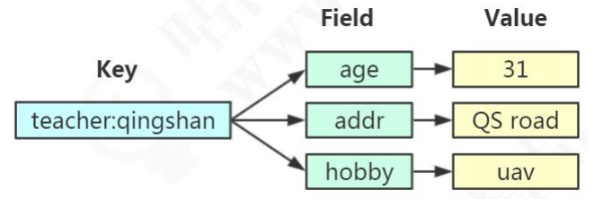
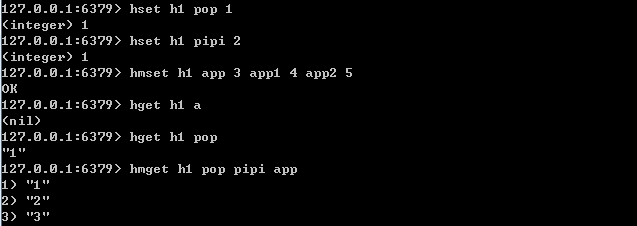
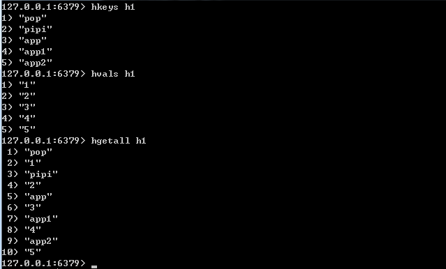
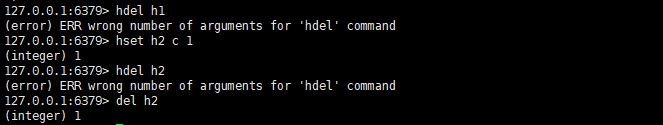
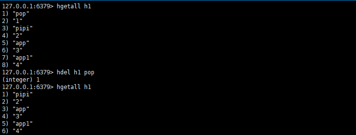
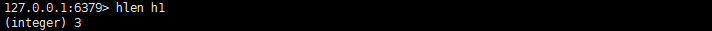
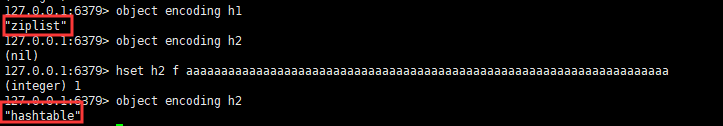
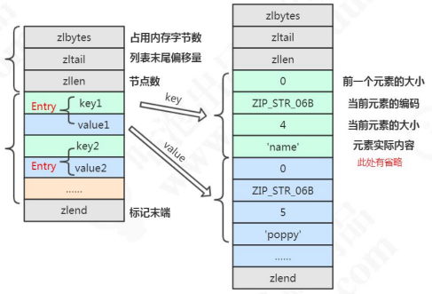
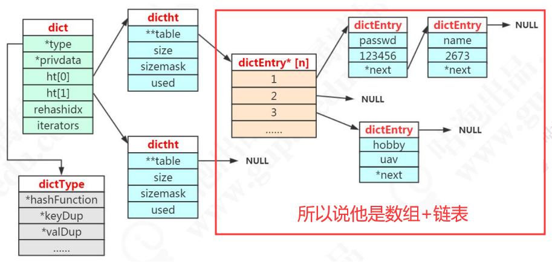

### Hash

简单的数据结构还好，但要是复杂的数据，例如用一个key存储一张表的数据，就有些麻烦，你不可能每次设置值都像是这样

```
mest student:1:sno 001 student:1:sname:pop student:2:age:18
```

然后获取值的时候

```
mget student:1:sno student:1:sname student:1:age
```

很明显，key为了表达所存储字段到底含义，太长，而且占用空间很大。

#### Hash 哈希



在`hash`的结构中，`key`更像是一种命名空间，在他的管辖下是另一个字段-值的组合。这有利于我们存储一个对象。

需要注意的是，value只能是字符串，不能镶嵌其它类型

> 同样是存储字符串，Hash和与String的主要区别

* 之前，我们定义一个对象需要若干个key与value的组合，现在只需要一个，把所有相关的值聚集到了一个key中，节省内存空间。
* 只用了一个key，减少key冲突
* 当需要批量获取值的时候，只需要使用一个命令，减少内存/IO/CPU的消耗。

> Hash 不适合到底场景

* Field 不能单独设置过期时间
* 没有 bit 操作
* 需要考虑数据量分布的问题（value 值非常大的时候，无法分摊到其他节点）

#### 操作命令



首先设置 key 然后是field，最后是value



当你希望对hash的key做些什么操作的时候，可以使用以下操作符

判断key是否存在

```
exists hl
```

删除一个key中的field，需要注意的是，你无法直接删除一个hash的key，如果你希望删除，可以直接使用del指令



`hdel`只支持删除key中的field



获得hash的长度

```
hlen h1
```



#### Hash的存储原理

之前我们说过redis的结构之前讲过一个外层的哈希，也就是Redis本身的KV实现(虽然KV只用到了hashtable)

。而当存储hash数据类型的时候，我们就把它叫做内层的哈希，内层的哈希底层使用到了两种数据结构实现。

* ziplist : OBJ_ENCODING_ZIPLIST ( 压缩列表)
* hashtable : OBJ_ENCODING_HT ( 哈希表)



----

##### ZipList

ziplist是一个经过特殊编码的双向链表，链表在我们印象中存储着上一个节点和下一个节点的指针，但ziplist中，它存储的是**上一个节点的长度和当前节点的长度**，通过牺牲部分读写性能来换取高效的内存空间利用率，是一种事件换空间的思想。**只用在字段个数少，字段值小的场景里。**

```c
/* ziplist.c 第16行*/
* ZIPLIST OVERALL LAYOUT
 * ======================
 *
 * The general layout of the ziplist is as follows:
 *
 * <zlbytes> <zltail> <zllen> <entry> <entry> ... <entry> <zlend>
 *
 * NOTE: all fields are stored in little endian, if not specified otherwise.
    ... /
     
 typedef struct zlentry {
    unsigned int prevrawlensize; /* 上一个链表节点占用的长度*/
    unsigned int prevrawlen;     /* 存储上一个链表节点的长度数值所需要的字节数 */
    unsigned int lensize;        /* 存储当前链表节点长度数值所需要的字节数*/
    unsigned int len;            /* 当前链表节点所占长度 */
    unsigned int headersize;     /* 当前链表节点的头部大小(prevrawlensize + lensize)，即非数据域的大小. */
    unsigned char encoding;      /* 编码方式 */
    unsigned char *p;            /* 压缩链表以字符串的形式保存，该指针指向当前节点的其实位置 */
} zlentry;

/* 204 行 编码的格式*/
/* Different encoding/length possibilities */
#define ZIP_STR_MASK 0xc0
#define ZIP_INT_MASK 0x30
#define ZIP_STR_06B (0 << 6)
#define ZIP_STR_14B (1 << 6)
#define ZIP_STR_32B (2 << 6)
#define ZIP_INT_16B (0xc0 | 0<<4)
#define ZIP_INT_32B (0xc0 | 1<<4)
#define ZIP_INT_64B (0xc0 | 2<<4)
#define ZIP_INT_24B (0xc0 | 3<<4)
#define ZIP_INT_8B 0xfe
```



所以我们得出这样的一个结论，这里所谓的ziplist就一串字符串，在不同的位置上记录着不同的信息，来区别当前索引位到多少是存储什么信息的位置。

> 什么时候使用ziplist 存储

当hash对象同时满足一下两个条件的时候，使用ziplist编码

* 所有的键值对的键和值长度都小于等于64byte(一个英文字母一个字节)
* 哈希对象保存的键值对数量小于512个

```properties
# 我们在 redis.conf 中也可以配置这个属性
# Hashes are encoded using a memory efficient data structure when they have a
# small number of entries, and the biggest entry does not exceed a given
# threshold. These thresholds can be configured using the following directives.
hash-max-ziplist-entries 512
hash-max-ziplist-value 64
```

```c
/* Check if the ziplist needs to be converted to a hash table
	t_hash.c 当字段个数超过阈值，就会用hashtable作为编码
	源码 236 行
*/
        if (hashTypeLength(o) > server.hash_max_ziplist_entries)
            hashTypeConvert(o, OBJ_ENCODING_HT);
```

```c
/* Check the length of a number of objects to see if we need to convert a
 * ziplist to a real hash. Note that we only check string encoded objects
 * as their string length can be queried in constant time. 
 源码 37 行
 t_hash.c 当字段值长度过大，转为 hashtable
 */
void hashTypeTryConversion(robj *o, robj **argv, int start, int end) {
    int i;

    if (o->encoding != OBJ_ENCODING_ZIPLIST) return;

    for (i = start; i <= end; i++) {
        if (sdsEncodedObject(argv[i]) &&
            sdslen(argv[i]->ptr) > server.hash_max_ziplist_value)
        {
            hashTypeConvert(o, OBJ_ENCODING_HT);
            break;
        }
    }
}
```

所以，当一个hash对象超过`redis.conf`配置的阈值的时候，默认是 hash对象的键值个数超过512的时候，或者field与value的长度加起来超过64byte的时候，就会转化为hashtable(hash表)

##### Hashtable(dict)

在redis中，hashtable被称为字典 ( dictionary)，它是一个**数组+链表**的结构。

我们之前说Redis的KV的结果是通过dictEntry来实现的，他还有一个指向下一个dictEntry的next指针。

```c
/* dict.h*/
typedef struct dictEntry {
    void *key; /* 我们熟悉的 key 关键字定义*/
    union {
        void *val;
        uint64_t u64; /* 有一个指定 redisObject 结果，然后间接指向一个SDS 这里是value定义的地方*/
        int64_t s64;
        double d;
    } v;
    struct dictEntry *next;
} dictEntry;
```

redis 又对 dictEntry进行了多层的封装来实现 hashtable的数据结构

```c
/* This is our hash table structure. Every dictionary has two of this as we
 * implement incremental rehashing, for the old to the new table. */
typedef struct dictht {
    dictEntry **table; /* 哈希表数组*/
    unsigned long size; /*哈希表大小*/
    unsigned long sizemask; /*掩码大小，用于计算索引值，总是等于 size-1*/
    unsigned long used; /*已用节点数*/
} dictht;
```

同时，又将dictht又放到了dict里面。

```c
typedef struct dict {
    dictType *type; /*字典类型*/
    void *privdata; /* 私有数据*/
    dictht ht[2];  /*一个字典有两个哈希表*/
    long rehashidx; /* rehash 索引 */
    unsigned long iterators; /* 当前正在使用的迭代器的数量 */
} dict;
```

所以从最底层到最高层 dictEntry->dictht->dict->OBJ_ENCODING_HT



dictht 后面是 NULL 说明第二个 ht 还没用到。dictEntry*后面是 NULL 说明没有 hash 到这个地址。dictEntry 后面是NULL 说明没有发生哈希冲突。

