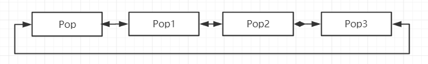
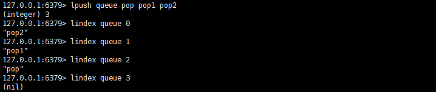
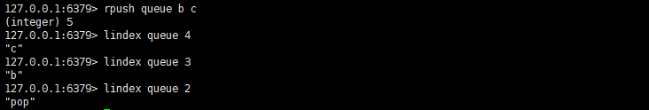
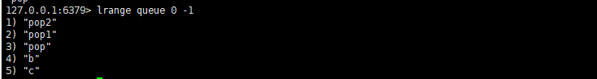
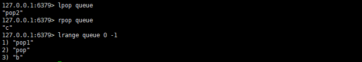
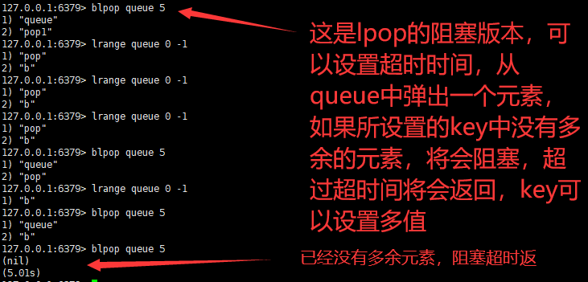
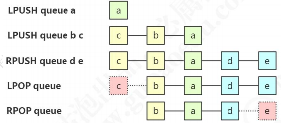
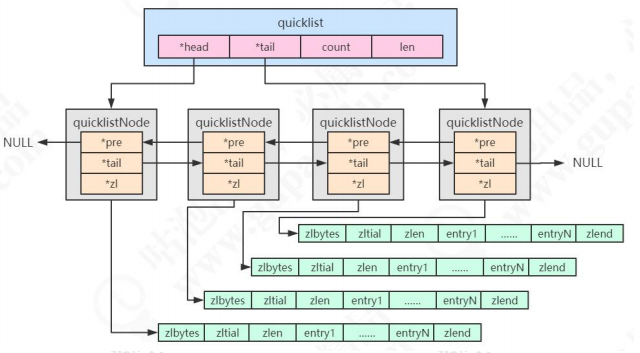

### List

##### 存储类型

存储有序的字符串（从左到右），元素可以重复，可以充当队列和栈的角色



你可以根据自己的需求，来具体将元素塞进队列的哪个方向



从左边插入，意味着索引最大位置是最先进插入的那个。





可以取出所有的值的命令。

可以从选择从左边或者右边弹出结果，并删除该方向上最前的一个结果。



还有一个`lpop`与`rpop`的超时版本



上面几个操作的画图演示



##### 存储（实现）原理

在早期的版本中，数据量较小的时候用ziplist存储，达到临界值的时候转化为linkedlist进行存储，分别对应OBJ_ENCODING_ZIPLIST和OBJ_ENCODING_LINKEDLIST。

3.2版本之后，统一用quicklist来存储，quicklist存储了一个双向链表，每个节点都是一个ziplist。


##### Quicklist

quicklist快速列表是ziplist和linkedlist的结合体

```c
/*quicklist.h 73行*/
typedef struct quicklist {
    quicklistNode *head;  /*指向双向列表的表头*/
    quicklistNode *tail; /* 指向双向列表的表尾*/
    unsigned long count;        /* 所有的ziplist中一共存储了多少个元素 */
    unsigned long len;          /* 双向链表的长度，node的数量 */
    int fill : 16;              /* fill factor for individual nodes */
    unsigned int compress : 16; /* 压缩深度，0：不压缩 */
} quicklist;
```

```properties
# redis.conf 1083行
# 正数表示单个 ziplist 最多所包含的 entry 个数。
# 负数代表单个 ziplist 的大小，默认 8k。
# -1：4KB；-2：8KB；-3：16KB；-4：32KB；-5：64KB
list-max-ziplist-size -2

# 1099 行
# 压缩深度，默认是 0。
# 1：首尾的 ziplist 不压缩；2：首尾第一第二个 ziplist 不压缩，以此类推
list-compress-depth 0
```

```c
/* quicklist.h*/
typedef struct quicklistNode {
    struct quicklistNode *prev; /* 前一个节点 */
    struct quicklistNode *next; /* 后一个节点 */
    unsigned char *zl; /* 指向实际的 ziplist */
    unsigned int sz; /* 当前 ziplist 占用多少字节 */
    unsigned int count : 16; /* 当前 ziplist 中存储了多少个元素，占 16bit（下同），最大 65536 个 */
    unsigned int encoding : 2; /* 是否采用了 LZF 压缩算法压缩节点，1：RAW 2：LZF */
    unsigned int container : 2; /* 2：ziplist，未来可能支持其他结构存储 */
    unsigned int recompress : 1; /* 当前 ziplist 是不是已经被解压出来作临时使用 */
    unsigned int attempted_compress : 1; /* 测试用 */
    unsigned int extra : 10; /* 预留给未来使用 */
} quicklistNode;
```



如图所示，`quicklist`是一个拥有目标链表引用的对象，只记录由`quickNode`构成的链表的头部和尾部，分别保存到字段里面，`quicklistNode`记录了`ziplist`的引用，还有他的一些信息，例如存储了多少元素之类的，然后就是该双向链表的头和尾。

> 消息队列

List 提供了两个阻塞的弹出操作：BLPOP/BRPOP，可以设置超时时间。
BLPOP：BLPOP key1 timeout 移出并获取列表的第一个元素， 如果列表没有元素
会阻塞列表直到等待超时或发现可弹出元素为止。
BRPOP：BRPOP key1 timeout 移出并获取列表的最后一个元素， 如果列表没有元
素会阻塞列表直到等待超时或发现可弹出元素为止。
队列：先进先出：rpush blpop，左头右尾，右边进入队列，左边出队列。
栈：先进后出：rpush brpop