### Redis（Remote Dictionary Service）

[Redis 设计与实现](<http://redisbook.com/>)

redis 主要是为了减缓数据库的压力而开发出来的运行于内存的数据库，并且他也有自己的持久化技术，集群和分布式解决方案。


#### Redis 与 SQL 与 NoSQL

> 关系型数据库的特点

* 表格的形式，行来存储数据，是一个二维形式
* 存储的是结构化的数据，数据结构有固定的模式，数据需要适应表结构
* 表与表之间存在关系( Relationship)
* 大部分关系型数据库支持SQL(结构化查询语句)的操作，支持复杂的关联查询。

* 通过支持事务(ACID酸，原子性，一致性，隔离，持久)来保证数据的一致性

> 关系型数据库的缺点

* 扩容麻烦，即当mysql的存储达到磁盘最大容量，必须通过堆积硬件的方法实现扩容，也就是所谓的垂直扩容，并且不支持动态扩容。水平扩容需要复杂的实现，例如分库分表
* 表结构修改的困难，因此存储的数据格式也受到了限制
* 高并发和高数据量的情况下，我们的关系型数据库会读写到磁盘，这样的磁盘压力会比较大


由此非关系数据库孕育而生，non-relational 活着 Not Only SQL，NoSQL 最开始是不提供 SQL 的数 

据库的意思，但是后来意思慢慢地发生了变化。

> 非关系型数据库的特点

* 存储非结构化的数据，比如文本，图片，音频，视频，比较自由

* 表与表之间没有关联，可扩展性强

* 保证数据的最终一致性。遵循BASE(碱)理论，。 Basically Available（基本 

  可用）； Soft-state（软状态）； Eventually Consistent（最终一致性）。

* 支持海量数据存储和高并发的读写。

* 支持分布式，能够对数据进行分片存储，扩缩容简单


更多非关系型数据库，请查阅 <http://nosql-database.org/>


#### Redis 的特性

之前也说了，redis说到底也就是用c写的一个缓存服务，使用也缓存也是为了取数据的的时候补用走一遍大流程，而是直接从缓存那边取就可以了。

Redis 的特性： 

* 更丰富的数据类型 

* 进程内与跨进程；单机与分布式 

* 功能丰富：持久化机制、过期策略 

* 支持多种编程语言 

* 高可用，集群


#### Redis 的安装

> linux上的安装 Redis 单实例  

[linux下的安装](./INSTALL.md)

> window 上安装 Redis  

```
https://github.com/MicrosoftArchive/redis/tags
```

下载完成后，直接启动。

```cmd
redis-server.exe redis.windows.conf
```

在客户端运行

```
shutdown
```

将会终止redis服务端

redis 的参数可以通过三种方式配置，一种是 redis.conf，一种是启动时--携带的参数，一种是 config set。

redis可视化工具

```
链接: https://pan.baidu.com/s/1GOkRg1JSbJYTP_6JPhAYtQ 提取码: ge7m 
```


#### 基本操作

redis中默认有16个库，这一点可以在配置文件中修改，默认使用第一个库，也就是db0

```properties
# Set the number of databases. The default database is DB 0, you can select
# a different one on a per-connection basis using SELECT <dbid> where
# dbid is a number between 0 and 'databases'-1
databases 16
```

这里我们使用一个可视化的工具

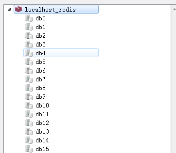

因为没有完全隔离，不像数据库的 database，不适合把不同的库分配给不同的业务使用。

```
select 0
select 15
select 8
```

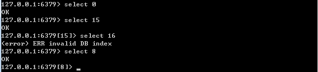

清空当前数据库

```
flushdb 
```

清空所有的数据库

```
flushall
```

redis更为详细的操作指南

http://redisdoc.com/index.html

存值

```
set pop 123
```

取值

```
get pop
```

查看所有的键

```
keys *
```

获取键总数

```
dbsize
```

查看键是否存在

```
exists pop
```

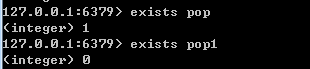

返回 `1`表示存在，返回`0`表示不存在

删除键，可以删除多个，因为参数提示是个数组

```
del pop pipi
```

重命名 前面是旧值，后面是新值

```
rename pop pop1
```


#### Redis 的基本数据类型

redis有几种数据类型，这边说得是数据类型而不是数据结构

数据类型可以理解成每个语言原生的类型，例如int，long等，而数据结构更多可能包含逻辑和更加复杂的结构，例如java中的对象

redis的数据类型的介绍<https://redis.io/topics/data-types-intro>

```
String、Hash、Set、List、Zset、Hyperloglog、Geo、Streams
```

> 存储类型

用来 存储字符串、整数、浮点数

```
mset pop2 123 pop3 123
```

设置值，如果key存在，则不成功

```
setnx pop 123
```


其实这个地方可以有一个分布式锁的实现。

首先 `setnx lock 1`设置，如果成功就表示获得了锁，然后 `del lock`

释放锁。但是如果释放锁的操作失败了，导致其他节点获取不到锁就有问题了，所以还需要加入超时的时间。

```
expire pop 5
```

表示这个键`5s`后过期，不过如果这个时间段里，事情完成了一般就释放了，就无法保证原子性。

我们可以使用多参数的set

```
EX seconds ： 将键的过期时间设置为 seconds 秒。 执行 SET key value EX seconds 的效果等同于执行 SETEX key seconds value 。

PX milliseconds ： 将键的过期时间设置为 milliseconds 毫秒。 执行 SET key value PX milliseconds 的效果等同于执行 PSETEX key milliseconds value 。

NX ： 只在键不存在时， 才对键进行设置操作。 执行 SET key value NX 的效果等同于执行 SETNX key value 。

XX ： 只在键已经存在时， 才对键进行设置操作
```

```
set key value [expiration EX seconds|PX milliseconds][NX|XX]
```

例如，你可以设置一个key的，只有他不存在的时候才可以设置，并且十秒后过期

```
set lock 1 EX 10 NX
```

(整数)值递增，结果累加一

```
incr pop
```

(整数)值递增，结果累加一个指定的值，这个例子中本体加上200

```
incrby pop 200
```

(整数)值递增，结果减一

```
decr pop
```

(整数)值递增，结果减去一个指定的值，这个例子中本体加上200

```
decr pop 200
```

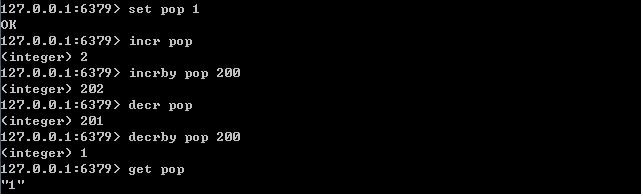

如图所示，他会返回计算后的结果

浮点数增加到以后的数值

```
set f 2.6
incrbyfloat f 7.3
```

获取多个值

```
mget pop pop1
```

获取值的长度

```
strlen pop
```

字符串追加内容

```
append pop good
```

获取指定范围的字符

```
getrange pop 0 8
```


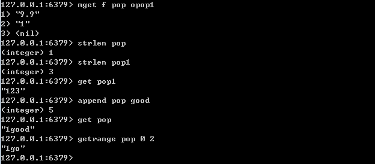

#### Redis 的数据模型

set hello word 为例，因为 Redis 是 KV 的数据库，它是通过 hashtable 实现的（我 

们把这个叫做外层的哈希）。所以每个键值对都会有一个 dictEntry（源码位置：dict.h）， 

里面指向了 key 和 value 的指针。next 指向下一个 dictEntry。

```c
/* Unused arguments generate annoying warnings... */
#define DICT_NOTUSED(V) ((void) V)

typedef struct dictEntry {
    void *key; /* key关键字的位置，在上面的例子，就是 hello*/
    union {
        void *val;
        uint64_t u64; /* value 的位置，也就是 world的存储位置*/
        int64_t s64;
        double d;
    } v;
    struct dictEntry *next; /* 指向下一个 dictEntry*/
} dictEntry;
```

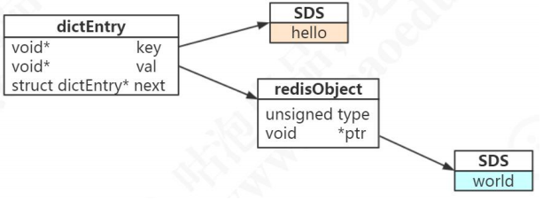

在这个数据结构中，key的数据格式为SDS，SDS的含义之后会解释，本质上还是一个字符串，只不过他没有使用C中的字符数组，而是直接存储在自定义的SDS中。

value与key有所不同，他并不是直接存储字符串，而是直接存储在`redisObject`，事实上五种常用的数据类型中的任意一种

```
String、Hash、Set、List、Zset
```

都可以存储在`redisObject`中，而`redisObject`算是一种兼容的解决方案，通过它来存储真正的value。

`redisObject` 定义在 `src/server.h` 文件中。

```c
typedef struct redisObject {
    unsigned type:4;/* 对象的类型，包括：OBJ_STRING、OBJ_LIST、OBJ_HASH、OBJ_SET、OBJ_ZSET */
    unsigned encoding:4;/* 具体的数据结构 类似 object encoding xxx*/
    unsigned lru:LRU_BITS; /* LRU time (relative to global lru_clock) or
                            * LFU data (least significant 8 bits frequency
                            * and most significant 16 bits access time). 
                            /* 24 位，对象最后一次被命令程序访问的时间，与内存回收有关 */
                            */
    int refcount;/* 引用计数。当 refcount 为 0 的时候，表示该对象已经不被任何对象引用，则可以进行垃圾回收了 */
    void *ptr;/* 指向对象实际的数据结构 */
} robj;
```

你可以使用`type`命令来查看对外的类型

```
type pop
```

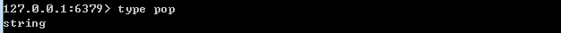

之前说到，redis是按照KV存储，KV的数据格式是在C中定义的dictEntry，dictEntry的key字段是直接保存了我们定义的key，但是value却不是直接保存下来，而是用redisObject记录下来，redisObject里面又指向了对象实际的数据结果，也就是ptr字段。

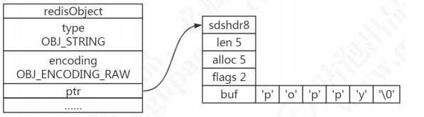

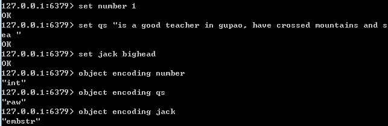

字符串类型的内部编码有三种

* int （四个字节），long（八个字节 2^63-1）
* embstr，代表emstr格式的SDS（Simple Dynamic String 简单动态字符串），存储小于44个字节的字符串
* raw，存储大于44个字节的字符串（3.2版本之前是39个字节）

```c
/* object.c */
/* Create a string object with EMBSTR encoding if it is smaller than
 * OBJ_ENCODING_EMBSTR_SIZE_LIMIT, otherwise the RAW encoding is
 * used.
 *
 * The current limit of 44 is chosen so that the biggest string object
 * we allocate as EMBSTR will still fit into the 64 byte arena of jemalloc. */
#define OBJ_ENCODING_EMBSTR_SIZE_LIMIT 44
```

> 什么是SDS？

SDS ，称为 （Simple Dynamic String 简单动态字符串），这个也是`redis`自己定义的用于存储不同长度的字符串。

在 3.2 以后的版本中，SDS 又有多种结构（sds.h）：sdshdr5、sdshdr8、sdshdr16、sdshdr32、sdshdr64，用于存储不同的长度的字符串，分别代表 2^5=32byte， 2^8=256byte，2^16=65536byte=64KB，2^32byte=4GB。

```c
/* sds.h*/

typedef char *sds;

/* Note: sdshdr5 is never used, we just access the flags byte directly.
 * However is here to document the layout of type 5 SDS strings. */
struct __attribute__ ((__packed__)) sdshdr5 {
    unsigned char flags; /* 3 lsb of type, and 5 msb of string length */
    char buf[];
};
struct __attribute__ ((__packed__)) sdshdr8 {
    uint8_t len; /* 当前字符数组的长度 */
    uint8_t alloc; /* 当前字符数组总共分配的内存大小 */
    unsigned char flags; /* 当前字符数组的属性，用来标识这个是sdshdr8
    还是 sdshdr16 等*/
    char buf[]; /*字符串真正的值*/
};
struct __attribute__ ((__packed__)) sdshdr16 {
    uint16_t len; /* used */
    uint16_t alloc; /* excluding the header and null terminator */
    unsigned char flags; /* 3 lsb of type, 5 unused bits */
    char buf[];
};
struct __attribute__ ((__packed__)) sdshdr32 {
    uint32_t len; /* used */
    uint32_t alloc; /* excluding the header and null terminator */
    unsigned char flags; /* 3 lsb of type, 5 unused bits */
    char buf[];
};
struct __attribute__ ((__packed__)) sdshdr64 {
    uint64_t len; /* used */
    uint64_t alloc; /* excluding the header and null terminator */
    unsigned char flags; /* 3 lsb of type, 5 unused bits */
    char buf[];
};

```

> 为什么 Redis 要用 SDS 实现字符串 ？

在C语言中，是没有字符串类型的，所以只能用字符数组char[]实现

* 使用字符数组必须先给目标变量分配足够的空间，否则可能会溢出
* 如果要获取字符长度，必须遍历字符数组，时间复杂度是O(n)
* C字符串长度的变更会对字符数组做内存重分配。
* C中，通过从字符串开始到结尾以 '\0'来标记字符串的结束，因此不能保存图片，音频，视频，压缩文件等二进制(bytes)保存的内容，因为'\0'的添加会损坏这些文件。

Redis引入的SDS的当然是为了解决这些问题

* SDS之前定义了5种不同容量结构，不用担心内存溢出的问题，如果需要会对SDS进行扩容

* 由于SDS中定义记录当前字符串长度的字段，所以时间复杂度是O(n)

  ```c
  struct __attribute__ ((__packed__)) sdshdr8 {
      uint8_t len; /* 当前字符数组的长度 */
      uint8_t alloc; /* 当前字符数组总共分配的内存大小 */
      unsigned char flags; /* 当前字符数组的属性，用来标识这个是sdshdr8
      还是 sdshdr16 等*/
      char buf[]; /*字符串真正的值*/
  };
  ```

* 通过 “空间预分配” (sdsMakeRoomFor)和 “惰性空间释放”，防止多次重分配内存

* 判断结束的标志是`len`属性，所以不用考虑结尾‘\0’带来的问题，当然原本C的原始保存格式也可以同样适用。	

| C字符串                                      | SDS                                   |
| -------------------------------------------- | ------------------------------------- |
| 获取字符串长度的时间复杂度是O(n)             | 获取字符串长度的时间复杂度是O(1)      |
| API是不安全的，可能会造成缓冲区溢出          | API是安全的，不会造成溢出，必要时扩容 |
| 修改字符串长度N次必然需要执行N次内存重新分配 | 修改字符串长度的N次，最多执行N次分配  |
| 只能保存文本数据                             | 可以保存文本数据，和二进制数据        |
| 可以使用所有<string.h>库中的函数             | 可以使用部分<string.h>库中的函数      |

> embstr 和 raw 的区别？

* 我们知道在3.2版本之后，embstr由原来存储39个bytes变为了44个，当超过44就会转化为raw，能存储的长度是他们第一个区别。

* embstr的使用是只分配一次内存空间，在上面的图我们看到了redisObject的*ptr字段是指向了下一个SDS，这里我猜想的连续可能是44个字节加上原本reidsObject所占字节数正好可以是一个完整的内存，所以他们连续，例如正好占有64个字节之类的。对于raw来说，因为大于44个字节，所以导致，原本分配一次的工作需要分配两次，分别为RedisObject和SDS分配。

* 也是embstr是因为他好处是创建一次空间，所以他删除的时候，相比raw少释放一次sds的空间，应为redisObject和sds不连续在raw中。又因为他们是连续的，所以寻找方便。
* 当然坏处也有，embstr因为是连续的，所以你希望增加字符串长度的时候，需要重新分配内存，这也意味着redisObject和SDS也需要重新分配空间，同时，这个分配方式也会让embstr类型转化为raw，因此redis中的embstr是只读，如果你对他进行修改，无论修改的值是否超过了44个字节，都会转化为raw。

> int 和 embstr 什么时候转化为raw

当 int 数据不再是整数，或者大小超过了long的范围（2^63-1=9223372036854775807）,自动转化为embstr

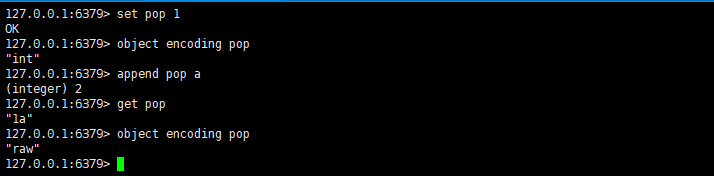

当然，要写一个超过long范围的数字比较麻烦，所以这里就直接将int直接append上了一个随机字符，让他不再是整数，而变成了raw

> 明明没有超过阈值，为什么会变成raw了

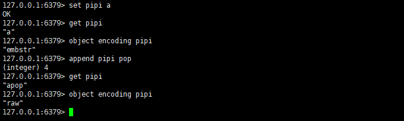

之前我们说过embstr因为是连续的，一次性分配内存到位，这样释放资源方便，同时索引也方便，但若要重新扩展就比较麻烦。而embstr他是只读的，所以对embstr对象修改的时候，需要先将它转化成raw对象再进行修改，因此只要是修改了embstr对象，最后一定会变成raw，无论是否到达了44个字节。

> 当长度小于阈值的时候，会还原吗

redis的内存编码转化，都符合以下规律

* 编码转化在Redis写入数据时完成，且过程不可逆。
* 只能从小内存编码向大内存编码转化，但是不包括重新set，set将会重新分配内存