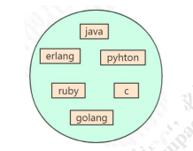
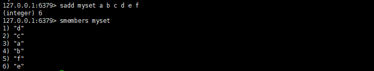
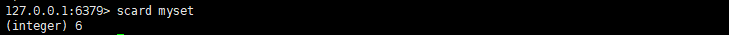
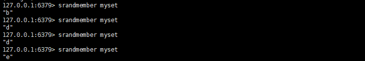
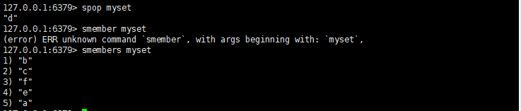
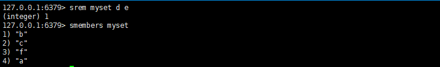
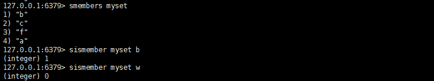
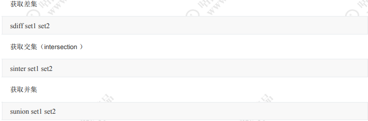

### Set 集合

存储类型

基本上，redis本身就是c所写的服务，那么c本身也不提供过多的复杂数据类型，用的最多的就是char[]

简而言之，就是String，对于set来说，是String类型的无须集合，最大的存储数量2^32-1(40)



##### 操作命令



添加元素，和获取全部元素

统计元素个数



随机获取一个元素



随机弹出一个元素



移除一个或多个元素



查看某个元素是否存在



#### 存储原理

Redis 用 intset 或 hashtable 存储 set。

**如果元素都是整数类型，就用 inset 存储。**
**如果不是整数类型，就用 hashtable（数组+链表的存来储结构）。**
问题：KV 怎么存储 set 的元素？key 就是元素的值，value 为 null。
如果元素个数超过 512 个，也会用 hashtable 存储。

```c
// redis.conf 
set-max-intset-entries 512
```

