### Redis 的一些高级特性

#### 发布订阅模式

> 列表的局限

之前我们说过列表list可以通过指令rpush和lpop实现消息队列(队尾进队，队头出去)，但是消费者需要不停的调用lpop查看list中是否有需要等待处理的消息，（比如写一个while循环，不停的调用），但是为了减少通信的消耗，可以sleep()一段时间再消费，但是这个地方有两个问题。

* 如果生产者的生产速度远大于消费者的消费速度，那么消息将会堆积，list会占用大量的内存
* redis的引用，是为了提高查询速度，实时性，但是这样不断的sleep就无法保证实时性。

不过我们还知道列表还提供了一个阻塞命令，blpop，没有任何元素可以弹出的时候，连接会被阻塞。

```
blpop queue 5
```

从左边弹出，key为queue的列表，超时时间为5秒，若五秒没有返回那么就会释放连接。但是，这种基于list实现的消息队列，不支持一对多的消息分发。

> 发布订阅模式

redis提供了一组命令实现发布/订阅模式。

订阅者可以获得发布者发布的实时消息，这种方式，发送者和接受者没有直接关联，实现了解耦，接受者不需要持续尝试获取消息，一旦得到订阅者的消息，就会得到反馈。

* 订阅频道

首先，我们有很多的频道( channel )，我们也可以把这个频道理解为queue，订阅者可以订阅一个或者多个频道，消息的发布者（生产者）可以指定给频道发布消息，则意味着我们可以创建多个频道即多个queue，发布者负责从频道存数据，订阅者负责从频道中拿数据。

只要消息到到达了频道，所有的订阅了这个频道的订阅者都会收到这条消息。

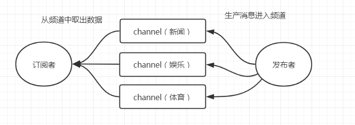


需要注意的是，发出去的消息不会被持久化，因为他已经从队列里面移除了，所以消费者只能收到他们开始订阅这个**频道之后发布的消息**。同时由于不会被持久化也不存在历史记录。

#### 具体使用

订阅者订阅频道，可以一次性订阅多个，比如这个客户端订阅了三个频道。

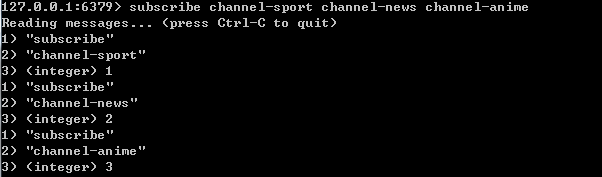

开始订阅的同时，这个个订阅者将会进入阻塞状态，等待频道发送消息，且订阅状态下主动取消**无法取消订阅状态**。

然后我们再起一个连接来充当发布者，向指定频道发布消息，只支持一次向一个频道发布消息，并不支持一次向多个频道发送消息。

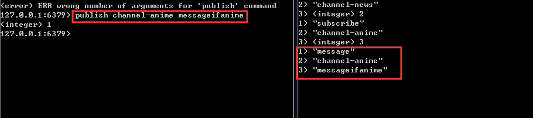

当然你希望取消订阅也是完全可以的，不过要退出订阅状态。

```
unsubscribe channel-anime
```

不过目前这个指令，我没操作出来，在退出订阅模式的时候，同时也退出了客户端，意味着之前订阅的可能也不复存在了，那么这时候取消订阅是否还有效果。

> 按照规则（Pattern）订阅频道

```
支持?和*占位符。？代表一个字符,*代表0个或者多个字符
```

消费端1，关注运动信息。任何以sport结尾的命名的频道都会被接受

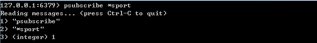

消费端2，关注所有新闻。任何以news开头的频道都会被接受，

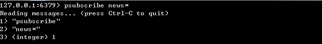

消费端3，关注所有天气新闻。必须允许一个随机字符的其他都匹配的news-weather

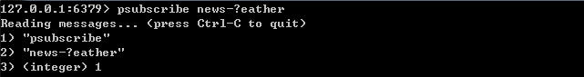

生产者，发送三条消息

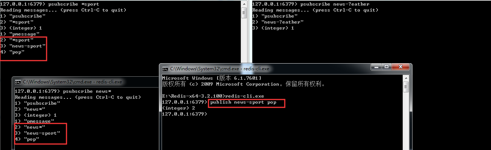

这里只匹配到了一条

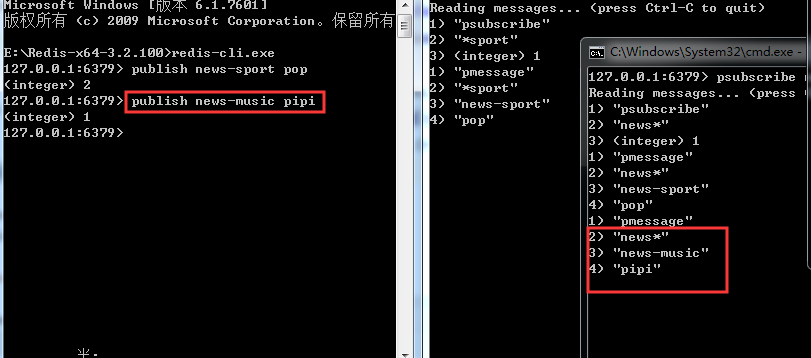

如果不匹配自然也不会发送到相关的订阅者

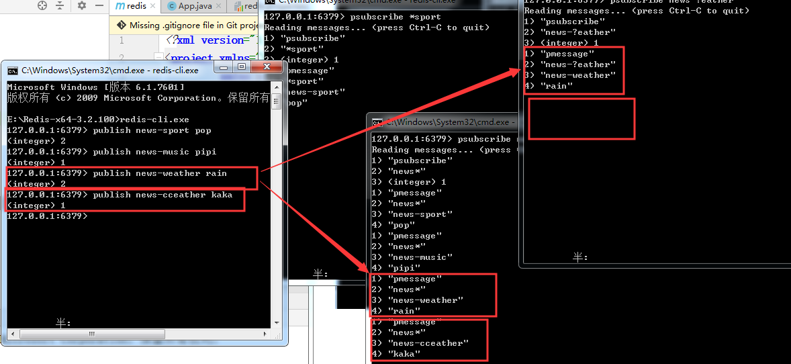

第二个语句，只有news匹配了，但是只允许匹配一个的`?eather`没有收到新的消息。

一张图总结这个过程。


> 如果在代码中取消订阅

// todo

---


#### Redis 事务

redis中的为什么需要用到事务，首先事务的这个概念是对一系列crud操作是否原子性的保证，不局限于数据库中的事务。

我们知道redis的单个命令是原子性的，比如，`get、set、mget、mset`，如果涉及到多个命名的时候，需要把多个命名作为一个不可分割到底处理序列，就需要用到事务。

例如我们之前说的用setnx时间分布式锁，我们先set，然后设置对key设置expire，即超时时间，防止del发生异常的时候，锁不会被释放，业务处理完以后在del，这三个动作我们希望他们作为一组命名执行。

Redis的事务涉及四个命名：multi（开启事务），exec（执行事务），discard（取消事务），watch（监视）

##### 事务的用法

我们用一个很常见的转账的例子，pop和pipi各有100块，pop向pipi转账10块。

对于我们来说是在pop的账户上减少10块，在pipi的账户上增加10块。

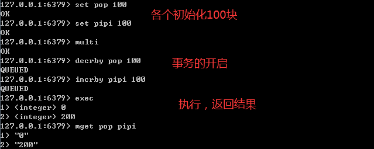

通过multi的命名开启事务。事务不能嵌套，多个multi命名效果是一样的。

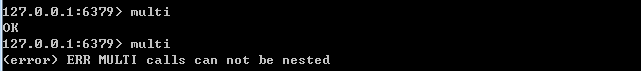

multi执行后，客户端可以继续向服务器发送任意多条命名，这些命名不会立即指向，而是放到一个队列中，当exec命名为调用时，所有队列中的命名才会被执行。

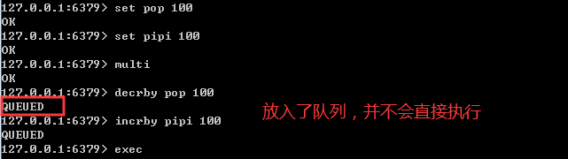

当你开启了一个事务，即使用了multi命名后，必须执行exec后，事务里面囤积在队列里的指令才会被执行，反之，如果你的命名都不会被执行。

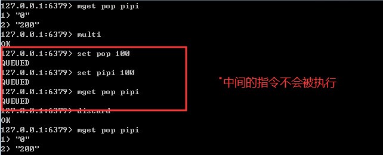

最后mget的结果还是不会变的。

如果你中途想要放弃事务，请使用`discard`，如上图所示，你将会放弃队列中的所有执行，退出事务，放弃执行

> watch 命令

redis里面中还提供了一个watch命名。他可以为redis事务提供cas乐观锁行为（Check and Set/Compare and Swap），也就是多个线程更新变量的时候，会和原值做比较，只有它没有被其他线程修改的情况下，才更新成新的值。

我们可以用watch监视一个或者多个key，如果开启事务之后，至少有一个被监视key键在exec执行之前被修改，那么整个事务都会被取消(key提前过期除外)。可以用unwatch取消。

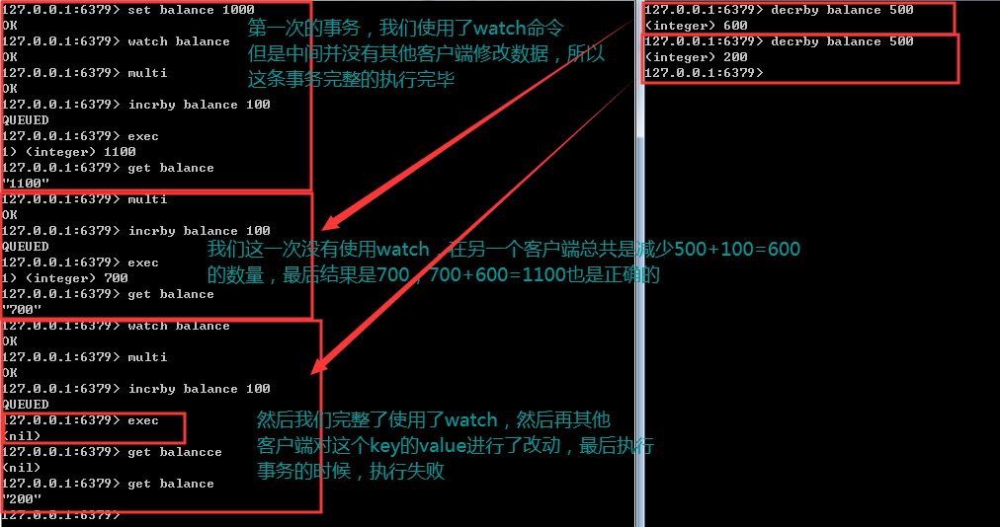

所以我们还可以得到一个结论就是，watch的效果只能持续一次事务，无论你的当前设置的事务成功或者失败，下次需要使用都需要重新设置。

> 事务可能遇到的问题

我们把事务执行遇到的问题分为两种，一种是在执行exec之前发生的操作，一种是在执行exec之后发生的错误。也就是在执行事务，入队列时候发生的错误，然后执行事务队列中囤积指令的报错。

* 在执行 exec 之前发生错误
  * 比如入队命名存在语法错误，包括参数数量，参数名等等（编译器错误）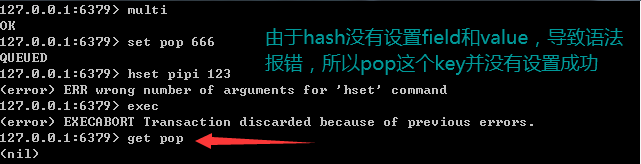这种情况下事务会被拒绝执行，也就是队列中所有的命名都不会得到执行
* 在执行exec之后发生错误
  * 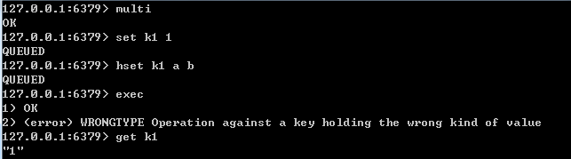比如，类型错误，比如对 String 使用了 Hash 的命令，这是一种运行时错误。最后我们发现 set k1 1 的命令是成功的，也就是在这种发生了运行时异常的情况下， 只有错误的命令没有被执行，但是其他命令没有受到影响。 这个显然不符合我们对原子性的定义，也就是我们没办法用 Redis 的这种事务机制 来实现原子性，保证数据的一致。

> 为什么在一个事务中存在错误，redis不回滚？

因为redis作者认为事务不应该在redis里面做，而应该在持久层上做。


#### Lua 脚本

lua是一种轻量级脚本语言，它是用C语言编写的，跟数据的存储过程有点类似。使用lua脚本来执行Redis命令的好处：

* 一次发送多个命令，减少网络开销，因为可以变成一个脚本，一口气发送给redis
* redis会将整个脚本作为一个整体执行，不会被其他请求打断，保持原子性。
* 对于复杂的组合命令，我们可以放在文件中，可以实现程序之间命令集复用

在redis中调用lua脚本

```
redis> eval lua-script key-num [key1 key2 key3 ....] [value1 value2 value3 ....]
```

* eval 代表的是执行 Lua语言的命令
* lua-script 代表的是 Lua语言脚本内容
* key-num 表示参数中有多少个key，需要注意的是redis中key是从1开始的，如果没有key的参数，那么写0
* [key1 key2 key3...]是key作为参数传递给lua语言，也可以不填，但是需要和key-num的个数保持一致
* [value1 value2 value3...]这些参数传递给lua语言，他们是可填写，可不填了，填了相当于是全局变量

返回一个字符串，0个参数

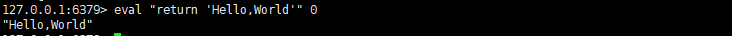

eval是具体的执行lua脚本的指令，后面需要用双引号囊括起来，字符串用单引号，因为我们并没有key传递进去，所以要写0，表示没有参数，是0个。

> 在Lua脚本中调用 Redis 命令

使用redis.call(command,key, [param1,param2]) 进行操作。语言格式。

```
redis> eval "redis.call('set',KEYS[1],ARGV[1])" 1 lua-key lua-value
```

* command 是命令，包括 set、get、del 等命令
* key 是被操作的键
* param1,param2...代表给key的参数

注意跟Java不一样，定义只有形参，调用只有实参。也就是说其实本质调用的是一个单词。

lua是在调用时用key表示形参，argv表示参数值（实参），是两个单词。

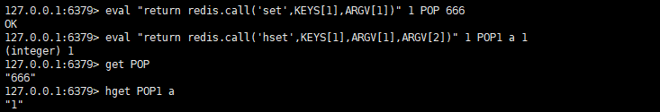

第一个命令等价于直接调用了 `set POP 666`，而第二个等价于直接调用了`hset POP1 a 1`

在redis-cli中直接写lua脚本不够方便，也不能实现编辑和复用，通常我们会把脚本放在文件里，然后执行这个文件。

> 在 Redis 中调用Lua脚本文件中的命令，操作Redis

我们可以现在创建一个文件夹专门放脚本

创建一个文件夹来放这些脚本 `mkdir luascript`

```
vim pop.lua
```

编写lua脚本内容，先设置，再取值。

```lua
redis.call('set',KEYS[1],ARGV[1])
return redis.call('get',KEYS[1])
```

现在我们在redis客户端中调用Lua脚本。

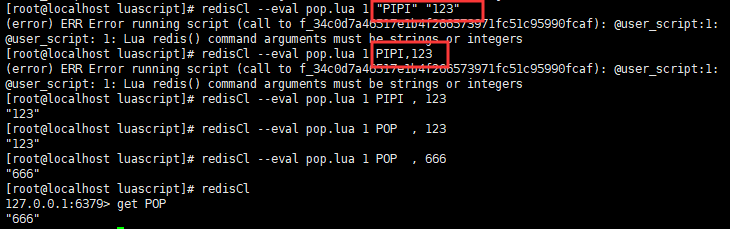

可以看到脚本很正常的执行了，**但是有一点区别需要注意的是**，如果我们不是用文件的形式存储lua脚本的话，执行的后面的参数是可以比较随意的。也就意味着

```
eval "return 'Hello'..KEYS[1]..ARGV[1]" 1 a 666
```

key与argv之前只需要用空格隔开就可以，但是写成lua脚本后，这样是会报错的，他们有更加严谨的写法，如上面的图所示，原本的参数写法已经不正确，我们在key与argv之间要用空格隔开的同时，还要加上逗号，但是如果是参数的话，只要是空格隔开就可以了。

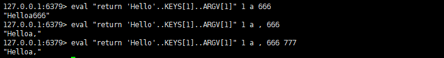

lua脚本的写法，和直接文本输入写法有些不同，写的时候，还请注意。

> 对 IP 进行限流

需求：在X秒内只能访问 Y 次。

设计思路：用key记录IP，用value记录访问次数。

拿到IP以后，对IP进行+1。如果是第一次访问，对key设置过期时间（参数1）。否则判断次数，超过限定次数（参数2），返回0。如果没有超过次数则返回1。超过时间，key过期之后，可以再次访问。

KEY[1]是IP，ARGV[1]是过期时间X，ARGV[2]是限制访问次数Y

```lua
-- ip_limit.la
-- IP 限流，对某个IP频率进行限制，6秒钟访问10次

local num = redis.call('incr',KEYS[1])
-- 首先对目标ip进行一次累加
if tonumber(num)==1 then
        -- 将其转化为数字，如果是第一次访问，设置超时时间，并返回1，表示还未被禁止
        redis.call('expire',KEYS[1],ARGV[1])
        return 1
        elseif tonumber(num)>tonumber(ARGV[2]) then
        --当超过指定的超时数目，将会被静止
                return 0
        else
        -- 还未到指定次数
                return 1
end

```

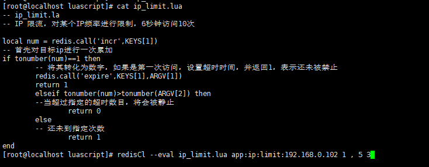

我们对`app:ip:limit:192.168.0.102`作为键，设置，如果是第一次进去，设置五秒超时时间，在指定时间内，允许3次访问，如果超过三次访问，将会返回0，表示禁止访问，1则还可以接着访问。

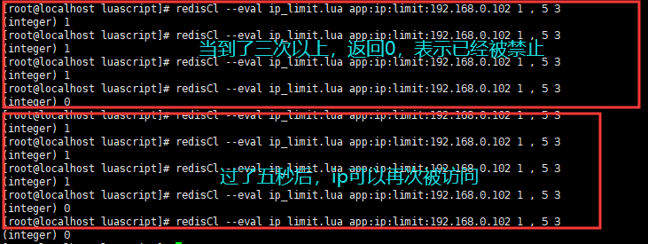

* app:ip:limit:192.168.8.111 是 key 值 ，后面是参数值，中间要加上一个空格 和
  一个逗号，再加上一个 空格 。
  即：./redis-cli –eval [lua 脚本] [key…]空格,空格[args…]

* 多个参数之间用一个 空格 分割 。

  

##### 缓存Lua脚本

> 为什么要缓存

在脚本比较长的情况下，如果每次调用脚本都需要把整个脚本传给 Redis 服务端，
会产生比较大的网络开销。为了解决这个问题，Redis 提供了 EVALSHA 命令，允许开发
者通过脚本内容的 SHA1 摘要来执行脚本。

> 如何缓存

Redis 在执行 script load 命令时会计算脚本的 SHA1 摘要并记录在脚本缓存中，执
行 EVALSHA 命令时 Redis 会根据提供的摘要从脚本缓存中查找对应的脚本内容，如果
找到了则执行脚本，否则会返回错误："NOSCRIPT No matching script. Please use
EVAL.

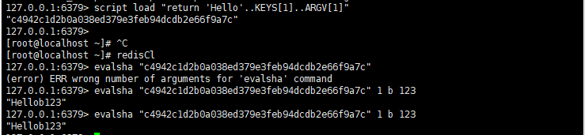

需要注意的是，由于生成sha摘要的时候，他并不会去检查是否有语法错误，在执行的时候，才会通过摘要从脚本缓存去寻找，所以编写的时候需要小心。

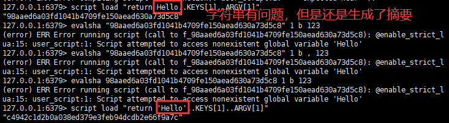

> 自乘案例

Redis 有 incrby 这样的自增命令，但是没有自乘，比如乘以 3，乘以 5。 

我们可以写一个自乘的运算，让它乘以后面的参数：

```lua
local curVal = redis.call("get", KEYS[1]) 
	if curVal == false then curVal = 0 
	else curVal = tonumber(curVal) end
	curVal = curVal * tonumber(ARGV[1]) 
redis.call("set", KEYS[1], curVal)
return curVal
```

把这个脚本变成单行，语句之间使用分号隔开 

```lua
local curVal = redis.call("get", KEYS[1]); if curVal == false then curVal = 0 else curVal = tonumber(curVal) end; curVal = curVal * tonumber(ARGV[1]); redis.call("set", KEYS[1], curVal); return curVal
```

script load '命令'

```
127.0.0.1:6379> script load 'local curVal = redis.call("get", KEYS[1]); if curVal == false then curVal = 0 else curVal = tonumber(curVal) end; curVal = curVal * tonumber(ARGV[1]); redis.call("set", KEYS[1], curVal); return curVal'
"be4f93d8a5379e5e5b768a74e77c8a4eb0434441"

127.0.0.1:6379> set num 2 OK 127.0.0.1:6379> evalsha be4f93d8a5379e5e5b768a74e77c8a4eb0434441 1 num 6 (integer) 12
```

##### 脚本超时

Redis 的指令执行本身是单线程的，这个线程还要执行客户端的 Lua 脚本，如果 Lua 脚本执行超时或者陷入了死循环，是不是没有办法为客户端提供服务了呢？

```lua
eval 'while(true) do end' 0
```

为 了防 止 某个 脚本 执 行时 间 过长 导 致 Redis 无 法提 供 服务 ， Redis 提 供 了 

lua-time-limit 参数限制脚本的最长运行时间，默认为 5 秒钟。

```properties
lua-time-limit 5000（redis.conf 配置文件中）
```

当脚本运行时间未超过这一限制后，Redis 将开始接受其他命令但不会执行（以确保脚 

本的原子性，因为此时脚本并没有被终止），而是会返回“BUSY”错误。

Redis 提供了一个 script kill 的命令来中止脚本的执行。新开一个客户端： 

```
script kill
```

如果当前执行的 Lua 脚本对 Redis 的数据进行了修改（SET、DEL 等），那么通过 

script kill 命令是不能终止脚本运行的。

```
127.0.0.1:6379> eval "redis.call('set','pop','666') while true do end" 0
```

因为要保证脚本运行的原子性，如果脚本执行了一部分终止，那就违背了脚本原子 

性的要求。最终要保证脚本要么都执行，要么都不执行。

```
127.0.0.1:6379> script kill (error) UNKILLABLE Sorry the script already executed write commands against the dataset. You can either wait the scripttermination or kill the server in a hard way using the SHUTDOWN NOSAVE command
```

遇到这种情况，只能通过 shutdown nosave 命令来强行终止 redis。 

shutdown nosave 和 shutdown 的区别在于 shutdown nosave 不会进行持久化 

操作，意味着发生在上一次快照后的数据库修改都会丢失。

---

##### Redis为什么这快

* 纯内存
* 单线程，避免上下文切换

更多解释请翻阅redis原理笔记。

----

#### 内存回收

Redis的所有数据都存储在内存中的，在某些情况下需要对占用内存空间进行回收。内存回收主要分为两类，一类是key过期，一类是内存使用达到上限（max_memory），触发内存淘汰

##### 过期策略

要设置key过期，我们有几种猜想。

> 定时过期（主动淘汰）

每个设置过期时间的key都需要创建一个定时器，达到到期时间就会立即清除。该策略可以立即清除过期数据，对内存很友好，但是会占用大量的CPU资源去处理过期的数据，从而影响缓存的响应时间和吞吐量。

> 惰性过期 （被动淘汰）

只有当访问一个key时，才会判断该key是否过期，过期则清除，该策略是最大化节省CPU资源，但是对内存不是很友好。极端情况下可能会出现大量过期key因为没有再次被访问，而被堆积，占用大量内存。

> 定期过期

```c
/* server.h*/
typedef struct redisDb {
    dict *dict; /* 所有的键值对 */
    dict *expires; /* 设置了过期时间的键值对 */
    dict *blocking_keys; /* Keys with clients waiting for data (BLPOP)*/
    dict *ready_keys; /* Blocked keys that received a PUSH */
    dict *watched_keys; /* WATCHED keys for MULTI/EXEC CAS */
    int id; /* Database ID */
    long long avg_ttl; /* Average TTL, just for stats */
    list *defrag_later; /* List of key names to attempt to defrag one by one, gradually. */
} redisDb;
```

每隔一定时间，会扫描一定数量的数据库的expires字典中一定数量的key，并清除其中已经过期的key。该策略是前两者的一个折中方案。**通过调整定时扫描的时间间隔和每次扫描的限定耗时**，可以在不同情况下使得CPU和内存资源达到最优的平衡效果。

在Redis中同时使用了**惰性过期**和**定时过期**两种过期策略。

当然，这里有一个问题就是，如果我就是设置了很多不过期的值，导致内存满了怎么办？


#### 淘汰策略

Redis内存淘汰策略，是指当内存使用达到最大内存极限时，需要使用淘汰算法来决定清理掉哪些数据，以保证新数据的存入。

> 最大内存设置。

```properties
# redis.conf 566行
# 系统默认是没有设置值，和下面这一行一样，如果你设置了单位是字节
# maxmemory <bytes>
maxmemory 1024 
```

如果不设置maxmemory或者设置为0，64位系统不限制内存，32位系统最多使用3GB内存。

动态修改：

```
config set maxmemory 2GB
```

回到之前思考的正题，到达了最大内存怎么办。

```properties
# reids.conf 571行 内存淘汰策略
# volatile-lru -> Evict using approximated LRU among the keys with an expire set.
# allkeys-lru -> Evict any key using approximated LRU.
# volatile-lfu -> Evict using approximated LFU among the keys with an expire set.
# allkeys-lfu -> Evict any key using approximated LFU.
# volatile-random -> Remove a random key among the ones with an expire set.
# allkeys-random -> Remove a random key, any key.
# volatile-ttl -> Remove the key with the nearest expire time (minor TTL)
# noeviction -> Don't evict anything, just return an error on write operations. 不做
# 任何淘汰动作，响应读操作，但是如果有写操作，将会返回错误信息
#
# LRU means Least Recently Used 最近最少使用
# LFU means Least Frequently Used 最不常使用 4.0版本增加
# Both LRU, LFU and volatile-ttl are implemented using approximated
# randomized algorithms. 随机删除
```

从算法上来看：

LRU means Least Recently Used 最近最少使用。判断最近被使用的时间，目前最远的数据优先被淘汰，意味着很久没使用的数据将会被淘汰。

LFU means Least Frequently Used 最不常使用，最小活跃度，用的少的将会被淘汰。

random，随机删除。

| 策略            | 含义                                                         |
| --------------- | ------------------------------------------------------------ |
| volatile-lru    | 根据 LRU 算法删除设置了超时属性（expire）的键，直到腾出足够内存为止。如果没有<br/>可删除的键对象，回退到 noeviction 策略。 |
| allkeys-lru     | 根据 LRU 算法删除键，不管数据有没有设置超时属性，直到腾出足够内存为止。 |
| volatile-lfu    | 在带有过期时间的键中选择最不常用的。                         |
| allkeys-lfu     | 在所有的键中选择最不常用的，不管数据有没有设置超时属性。     |
| volatile-random | 在带有过期时间的键中随机选择。                               |
| allkeys-random  | 随机删除所有键，直到腾出足够内存为止。                       |
| volatile-ttl    | 根据键值对象的 ttl 属性，删除最近将要过期数据。如果没有，回退到 noeviction 策略。 |
| noeviction      | 默认策略，不会删除任何数据，拒绝所有写入操作并返回客户端错误信息（error）OOM<br/>command not allowed when used memory，此时 Redis 只响应读操作。 |

这里可以做一个总结就是，带了volatile前缀的淘汰策略，会去优先寻找带有超时时间，也就是带有expire属性的键，然后具体是执行最近使用淘汰，还是最小活跃度淘汰，还是随机。

而allkeys将会选择忽视超时时间参数（expire）来执行具体策略。

动态改变淘汰策略

```
redis> config set maxmemory-policy volatile-lru
```

建议使用 volatile-lru，在保证正常服务的情况下，优先删除最近最少使用的 key

##### LRU 淘汰原理

> 如果基于传统的LRU算法实现Redis LRU 会有什么问题？

需要额外的数据结构存储，消耗内存。

Redis LRU 对传统的 LRU 算法进行了改良，通过随机采样来调整算法的精度。

如果淘汰策略是LRU，则根据配置的采样值 `maxmemory-samples`(默认是5个)

```properties
# The default of 5 produces good enough results. 10 Approximates very closely
# true LRU but costs more CPU. 3 is faster but not very accurate.
# redis.conf 608行
# maxmemory-samples 5
```

随机从数据库中选择m个key，淘汰其中热度最低的key对应缓存数据。所以采样参数m配置的越大越好，越能精确地查找到待淘汰的缓存数据，但是也小号更多的CPU计算，执行效率降低。

> 如何找出热度最低的数据？

Redis中的所有对象结构都有一个lru字段，且使用了unsigned的低24位，这个字段用来记录对象的热度。对象被创建时会记录lru值。被访问的时候会更新lru的值。这个值的基准并没有系统当前的时间戳，而是设置为全局变量

`server.lruclock`的值，以他为基准去更新lru中的值

```c
typedef struct redisObject {
    unsigned type:4;
    unsigned encoding:4;
    unsigned lru:LRU_BITS; /* LRU time (relative to global lru_clock) or
    * LFU data (least significant 8 bits frequency
    * and most significant 16 bits access time). */
    int refcount;
    void *ptr;
} robj;
```

> server.lruclock的值怎么来的？

Redis 中 有 个 定 时 处 理 的 函 数 serverCron ， 默 认 每 100 毫 秒 调 用 函 数updateCachedTime 更新一次全局变量的 server.lruclock 的值，它记录的是当前 unix时间戳。

```c
/* We take a cached value of the unix time in the global state because with
 * virtual memory and aging there is to store the current time in objects at
 * every object access, and accuracy is not needed. To access a global var is
 * a lot faster than calling time(NULL) 
 server.c 1058 line
 */
void updateCachedTime(void) {
    time_t unixtime = time(NULL);
    atomicSet(server.unixtime,unixtime);
    server.mstime = mstime();

    /* To get information about daylight saving time, we need to call localtime_r
     * and cache the result. However calling localtime_r in this context is safe
     * since we will never fork() while here, in the main thread. The logging
     * function will call a thread safe version of localtime that has no locks. */
    struct tm tm;
    localtime_r(&server.unixtime,&tm);
    server.daylight_active = tm.tm_isdst;
}
```

> 为什么不获取精确的时间而是放在全局变量中？不会有延迟的问题吗？

这样函数 lookupKey 中更新数据的 lru 热度值时,就不用每次调用系统函数 time，可以提高执行效率。OK，当对象里面已经有了 LRU 字段的值，就可以评估对象的热度了。函数 estimateObjectIdleTime 评估指定对象的 lru 热度，思想就是对象的 lru 值和全局的 server.lruclock 的差值越大（越久没有得到更新）， 该对象热度越低。

```c
/* Given an object returns the min number of milliseconds the object was never
 * requested, using an approximated LRU algorithm.
 evict.c 90 line
 */
unsigned long long estimateObjectIdleTime(robj *o) {
    unsigned long long lruclock = LRU_CLOCK();
    if (lruclock >= o->lru) {
        return (lruclock - o->lru) * LRU_CLOCK_RESOLUTION;
    } else {
        return (lruclock + (LRU_CLOCK_MAX - o->lru)) *
                    LRU_CLOCK_RESOLUTION;
    }
}
```

server.lruclock 只有 24 位，按秒为单位来表示才能存储 194 天。当超过 24bit 能表示的最大时间的时候，它会从头开始计算。

```properties
# server.h
#define LRU_CLOCK_MAX ((1<<LRU_BITS)-1) /* Max value of 
```

在这种情况下，可能会出现对象的 lru 大于 server.lruclock 的情况，如果这种情况
**出现那么就两个相加而不是相减来求最久的 key。**

为什么不用常规的哈希表+双向链表的方式实现？需要额外的数据结构，消耗资源。而 Redis LRU 算法在 sample 为 10 的情况下，已经能接近传统 LRU 算法了。

> 除了消耗资源之外，传统 LRU 还有什么问题？

如图，假设 A 在 10 秒内被访问了 5 次，而 B 在 10 秒内被访问了 3 次。因为 B 最后一次被访问的时间比 A 要晚，在同等的情况下，A 反而先被回收。

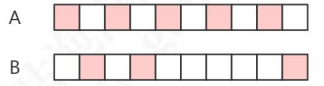

##### LFU 的淘汰原理

```c
/* server.h */
typedef struct redisObject {
    unsigned type:4;
    unsigned encoding:4;
    unsigned lru:LRU_BITS; /* LRU time (relative to global lru_clock) or
                            * LFU data (least significant 8 bits frequency
                            * and most significant 16 bits access time). */
    int refcount;
    void *ptr;
} robj;
```

当这 24 bits 用作 LFU 时，其被分为两部分：

* 高 16 位用来记录访问时间（单位为分钟，ldt，last decrement time）
* 低 8 位用来记录访问频率，简称 counter（logc，logistic counter）

counter 是用基于概率的对数计数器实现的，8 位可以表示百万次的访问频率。对象被读写的时候，lfu 的值会被更新。

```c
/* Update LFU when an object is accessed.
 * Firstly, decrement the counter if the decrement time is reached.
 * Then logarithmically increment the counter, and update the access time. 
 db.c 46 line
 */
void updateLFU(robj *val) {
    unsigned long counter = LFUDecrAndReturn(val);
    counter = LFULogIncr(counter);
    val->lru = (LFUGetTimeInMinutes()<<8) | counter;
}
```

增长的速率由，lfu-log-factor 越大，counter 增长的越慢

```properties
# lfu-log-factor 10
```

如果计数器只会递增不会递减，也不能体现对象的热度。没有被访问的时候，计数器怎么递减呢？减少的值由衰减因子 lfu-decay-time（分钟）来控制，如果值是 1 的话，N 分钟没有访问就要减少 N。

```c
# lfu-decay-time 1
```

-----

#### 持久化机制

Redis 速度快，很大一部分原因是因为它所有的数据都存储在内存中。如果断电或者 宕机，都会导致内存中的数据丢失。为了实现重启后数据不丢失，Redis 提供了两种持久 化的方案，一种是 RDB 快照（Redis DataBase），一种是 AOF（Append Only File）。

##### RDB

RDB 是 Redis 默认的持久化方案。当满足一定条件的时候，会把当前内存中数据写入磁盘，生成一个快照文件`dump.rdb`。Redis重启后会通过加载`dump.rdb`文件恢复数据。

什么时候写入rdb文件。

**RDB 触发**

> 自动触发

配置规则触发，redis.conf，SNAPSHOTTING，其中定义了触发把数据保存到磁盘的触发频率。 如果不需要 RDB 方案，注释 save 或者配置成空字符串""。

```properties
################################ SNAPSHOTTING  ################################
#
# Save the DB on disk:
#
#   save <seconds> <changes>
#
#   Will save the DB if both the given number of seconds and the given
#   number of write operations against the DB occurred.
#
#   In the example below the behaviour will be to save:
#   after 900 sec (15 min) if at least 1 key changed
#   after 300 sec (5 min) if at least 10 keys changed
#   after 60 sec if at least 10000 keys changed
#
#   Note: you can disable saving completely by commenting out all "save" lines.
#
#   It is also possible to remove all the previously configured save
#   points by adding a save directive with a single empty string argument
#   like in the following example:
#
#   save ""

save 900 1 # 900 秒内至少有一个 key 被修改（包括添加） 
save 300 10 # 400 秒内至少有 10 个 key 被修改 
save 60 10000 # 60 秒内至少有 10000 个 key 被修改
```

注意上面的配置是不冲突的，只要满足任意一个条件都会触发。

```properties
# 文件路径， 
dir ./ 
# 文件名称 
dbfilename dump.rdb 
# 是否是 LZF 压缩 rdb 文件 
rdbcompression yes 
# 开启数据校验 
rdbchecksum yes
```

| 参数           | 说明                                                         |
| -------------- | ------------------------------------------------------------ |
| dir            | rdb 文件默认在启动目录下（相对路径），config get dir 获取    |
| dbfilename     | 文件名称                                                     |
| rdbcompression | 开启压缩可以节省存储空间，但是会消耗一些 CPU 的计算时间，默认开启 |
| rdbchecksum    | 使用 CRC64 算法来进行数据校验，但是这样做会增加大约 10%的性能消耗，如果希望获取到最 |

