### Zset(有序集合)


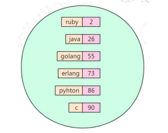

很明显，这是一个有序的set

sorted set，有序的 set，每个元素有个 score。
score 相同时，按照 key 的 ASCII 码排序。

| 数据结构     | 是否允许重复元素 | 是否有序 | 有序实现方法 |
| ------------ | ---------------- | -------- | ------------ |
| 列表list     | 是               | 是       | 索引下标     |
| 集合set      | 否               | 否       | 无           |
| 有序集合zset | 否               | 是       | 分值score    |

#### 操作命令

添加元素

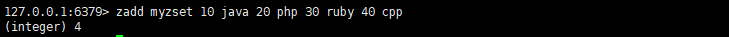

对具体范围的对象进行排序，可以正向也可以反向

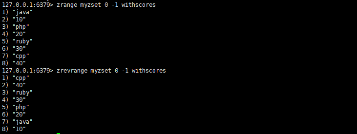

根据指定返回获取元素

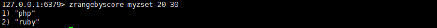

移除指定的元素，也可以根据rank删除，也就是排序顺序

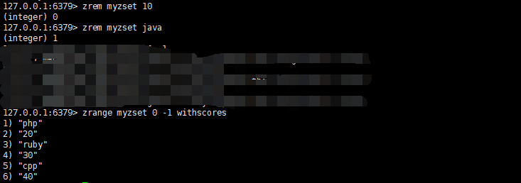

统计元素个数

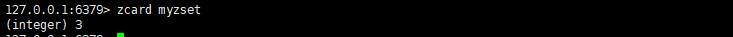

分值递增

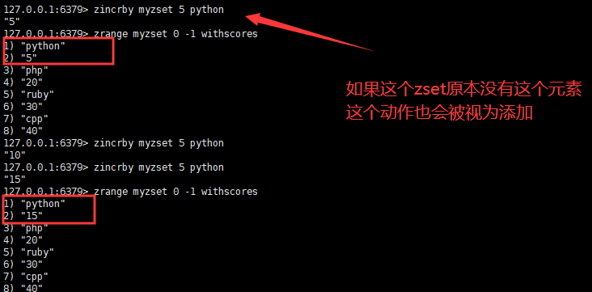

根据分值统计个数

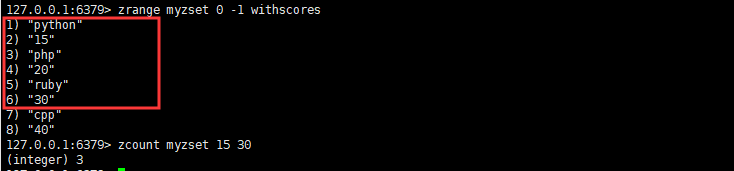

读取元素的rank

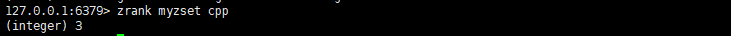

读取元素的score

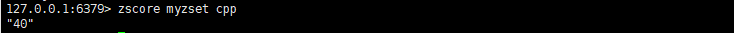

#### 存储原理

同时满足一下条件时，使用ziplist编码

* 元素数量小于128个
* 所有的member长度都小于64字节

在ziplist的内部，按照score排序递增来存储，插入的时候要移动之后的数据。

```properties
# redis.conf 里面的参数
zset-max-ziplist-entries 128
zset-max-ziplist-value 64
```

超过阈值后，就会使用skiplist+dict存储

> 什么是skiplist

skiplist就是我们尝尝说道的**跳表**

有序列表的结构：

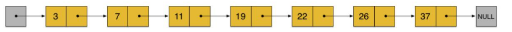

在这样一个链表中，如果我们要查找某个数据，那么需要从头开始逐个进行比较，
直到找到包含数据的那个节点，或者找到第一个比给定数据大的节点为止（没找到）。
也就是说，时间复杂度为 O(n)。同样，当我们要插入新数据的时候，也要经历同样的查
找过程，从而确定插入位置。
而二分查找法只适用于有序数组，不适用于链表。
假如我们每相邻两个节点增加一个指针（或者理解为有三个元素进入了第二层），
让指针指向下下个节点。

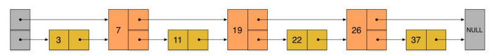

这样所有新增加的指针连成了一个新的链表，但它包含的节点个数只有原来的一半
（上图中是 7, 19, 26）。在插入一个数据的时候，决定要放到那一层，取决于一个算法
（在 redis 中 t_zset.c 有一个 zslRandomLevel 这个方法）。
现在当我们想查找数据的时候，可以先沿着这个新链表进行查找。当碰到比待查数
据大的节点时，再回到原来的链表中的下一层进行查找。比如，我们想查找 23，查找的

路径是沿着下图中标红的指针所指向的方向进行的：

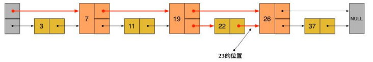

* 23 首先和 7 比较，再和 19 比较，比它们都大，继续向后比较。

* 但 23 和 26 比较的时候，比 26 要小，因此回到下面的链表（原链表），与 22
  比较。

* 23 比 22 要大，沿下面的指针继续向后和 26 比较。23 比 26 小，说明待查数
  据 23 在原链表中不存在
  在这个查找过程中，由于新增加的指针，我们不再需要与链表中每个节点逐个进行
  比较了。需要比较的节点数大概只有原来的一半。这就是跳跃表。

```c
/* server.h*/
typedef struct zskiplistNode {
    sds ele; /* zset 的元素 */
    double score; /* 分值 */
    struct zskiplistNode *backward; /* 后退指针 */
    struct zskiplistLevel {
        struct zskiplistNode *forward; /* 前进指针，对应 level 的下一个节点 */
        unsigned long span; /* 从当前节点到下一个节点的跨度（跨越的节点数） */
    } level[]; /* 层 */
} zskiplistNode;

typedef struct zskiplist {
    struct zskiplistNode *header, *tail; /* 指向跳跃表的头结点和尾节点 */
    unsigned long length; /* 跳跃表的节点数 */
    int level; /* 最大的层数 */
} zskiplist;

typedef struct zset {
    dict *dict;
	zskiplist *zsl;
} zset;
```

